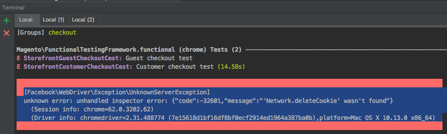

# Troubleshooting

Having a little trouble with the MFTF? See some common errors and fixes below.

## WebDriver issues

Troubleshoot your WebDriver issues on various browsers.

### PhantomJS

You are unable to upload file input using the MFTF actions and are seeing the following exception:

```terminal
[Facebook\WebDriver\Exception\NoSuchDriverException]
No active session with ID e56f9260-b366-11e7-966b-db3e6f35d8e1
```

#### Reason

Use of PhantomJS is not actually supported by the MFTF.

#### Solution

For headless browsing, the [Headless Chrome][]{:target="\_blank"} has better compatibility with the MFTF.

### Chrome

You are seeing an "unhandled inspector error" exception:

```terminal
[Facebook\WebDriver\Exception\UnknownServerException]
unknown error: undhandled inspector error: {"code":-32601, "message":
"'Network.deleteCookie' wasn't found"} ....
```



#### Reason

Chrome v62 is in the process of being rolled out, and it causes an error with ChromeDriver v2.32+.

#### Solution

Use [ChromeDriver 74.0.3729.6+][]{:target="\_blank"} and [Selenium Server Standalone v3.9+][]{:target="\_blank"} in order to execute tests in Google Chrome v62+.

### Firefox

Tests that use the `moveMouseOver` action cause an error when run locally.

#### Reason

There's a compatibility issue with Codeception's `moveMouseOver` function and GeckoDriver with Firefox.

#### Solution

None yet. Solving this problem is dependent on a GeckoDriver fix.

<!-- Link Definitions -->
[Headless Chrome]: https://developers.google.com/web/updates/2017/04/headless-chrome
[ChromeDriver 74.0.3729.6+]: https://chromedriver.storage.googleapis.com/index.html?path=2.33/
[Selenium Server Standalone v3.9+]: http://www.seleniumhq.org/download/
